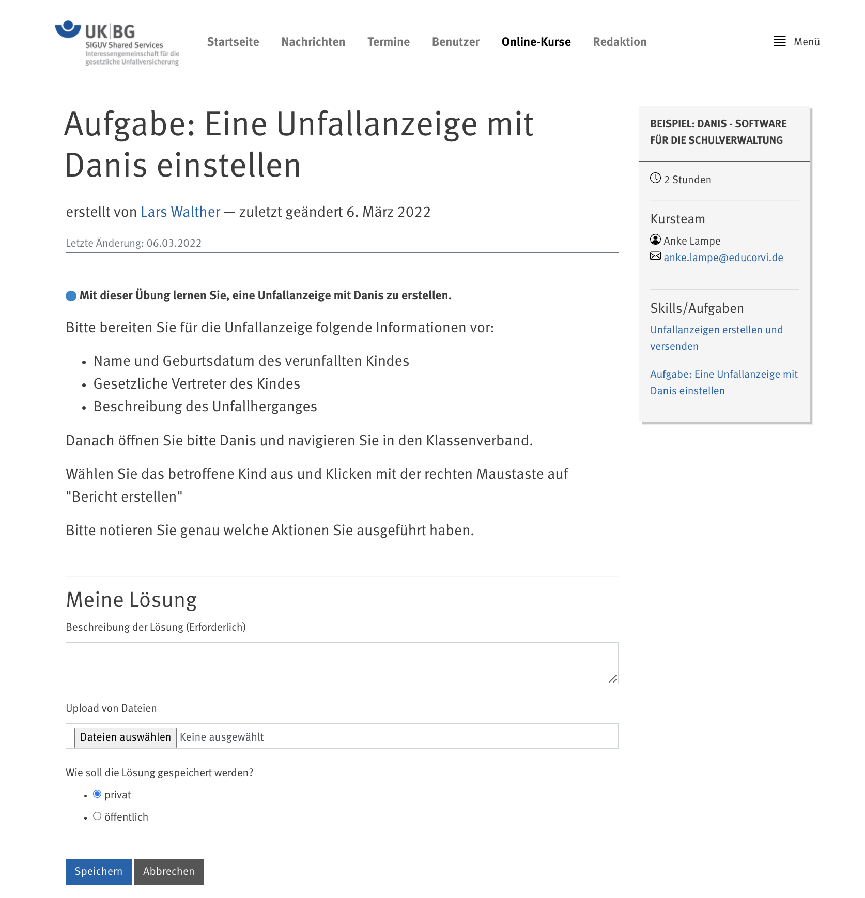
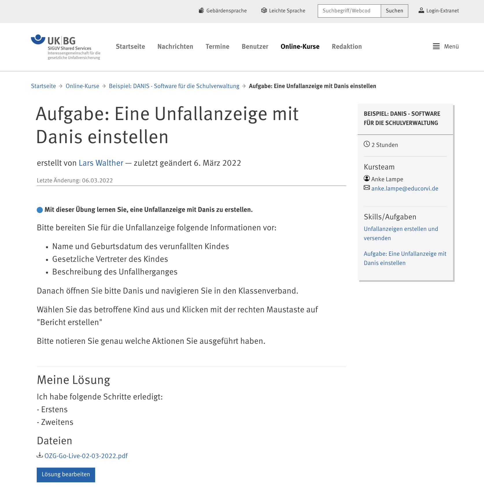
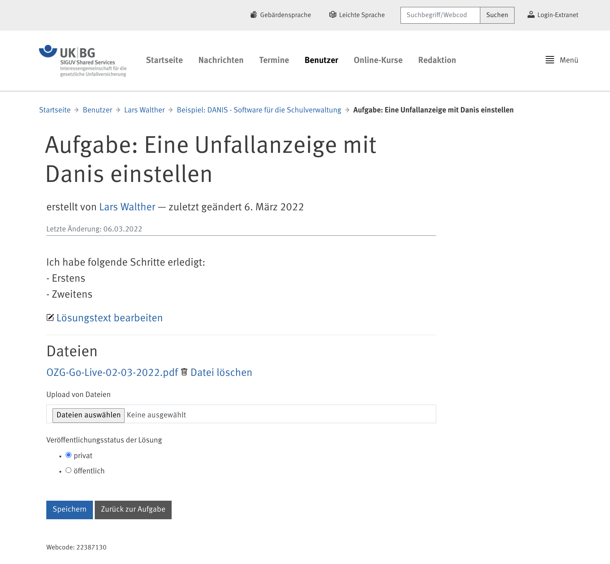
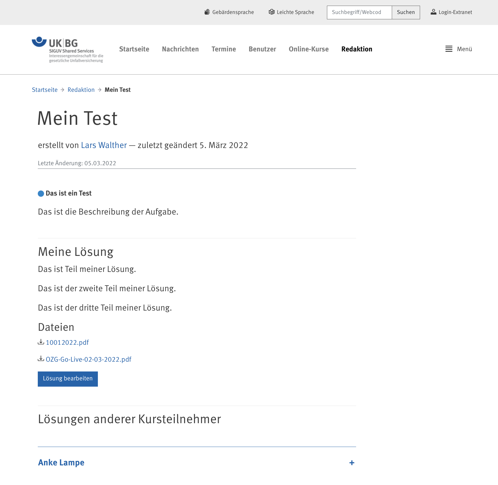

# edi.aufgabe

Mit diesem Plone-Add-On können Aufgaben zu einem Standard-Plone-Ordner zu einem Crashkurs 
(edi.crashkurs) oder zur einem Plone-Course (edi.plonecourse) hinzugefügt werden. Für die Lösung
einer Aufgabe wird ein Artikel "MeineAufgabe" im persönlichen Ordner des Benutzers angelegt.

## Leistungsmerkmale

- Beschreibung einer Aufgabe in Plone
- für die Lösung der Aufgabe wird ein Artikel "MeineAufgabe" im persönlichen Ordner des Benutzers abgelegt
- die Lösung wird im Kontext der Aufgabe anzeigt
- die Bearbeitung der Aufgabe erfolgt im Kontext von "MeinOrdner"
- die Benutzer können entscheiden, ob die eigene Lösung veröffentlicht (geteilt) werden soll
- die öffentlichen Lösungen anderer Kursteilnehmer werden in einem Akkordeon unter der eigenen Lösung dargestellt.

## Screenshots

### Neue Aufgabe im Crashkurs



### Aufgabe wurde bearbeitet



### MeineAufgabe in MeinOrdner



### Aufgabe im Crashkurs mit Lösungen anderer Kursteilnehmer




## Installation

### Voraussetzungen für die Installation

Installation der libmagic Bibliothek für das Betriebssystem Ubuntu:

```
sudo apt-get install libmagic-dev
```

Das Add-On verwendet WTForms und nutzt für die Integration in Plone einen Fork des Packages collective.wtforms

```
https://github.com/educorvi/collective.wtforms
```

Das Package muss so in den Builout integriert werden, dass es aus den Quellen geladen wird.

### Buildout

```
    [buildout]

    ...

    eggs +=
        edi.aufgabe
        collective.wtforms

    develop +=
        src/edi.aufgabe
        src/collective.wtforms

    [sources]
    edi.aufgabe = git https://github.com/educorvi/edi.aufgabe.git
    collective.wtforms = git https://github.com/educorvi/collective.wtforms.git
```

Danach kann der Buildout ausgeführt werden:

```
./bin/buildout
```

## Links

- Issue Tracker: https://github.com/educorvi/edi.aufgabe/issues
- Source Code: https://github.com/educorvi/edi.aufgabe

## Support

Lars Walther (info@educorvi.de)


License
-------

MIT License
